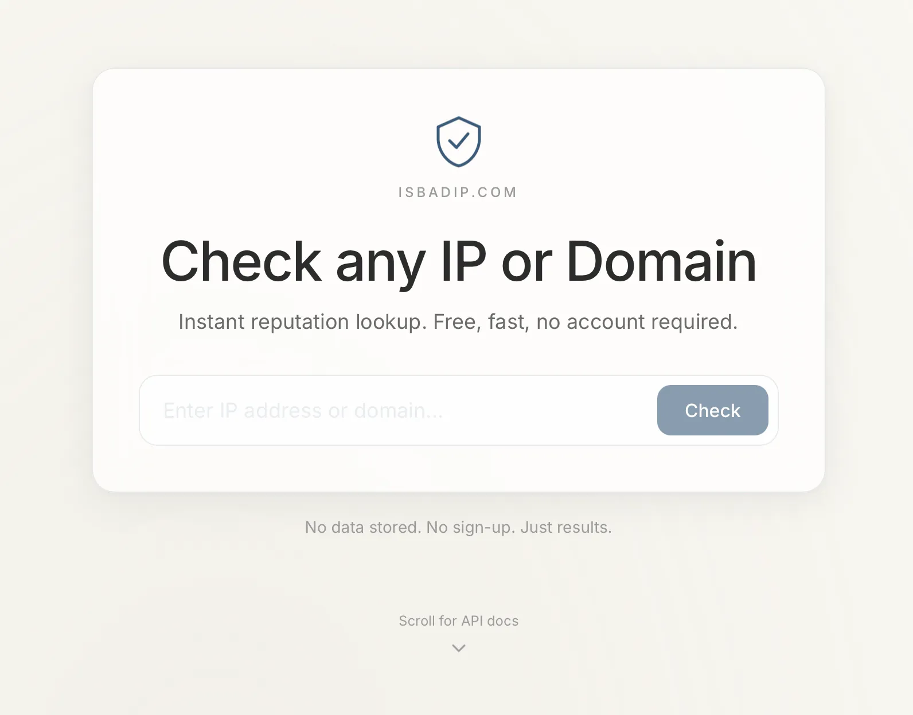

# isbadip

[](https://isbadip.com)
[](https://api.isbadip.com/api/v1/host/8.8.8.8)


Free IP and domain reputation lookup for quick security checks, scripts, and public integrations. `isbadip` combines public threat-intelligence feeds with custom lists from real IDS/IPS alerts and web-application attack logs, so it is more than a wrapper around the same public feeds everyone else already has.



No tracking. No account. No API key.

## Live

- Website: [https://isbadip.com](https://isbadip.com)
- Public API: [https://api.isbadip.com/api/v1/host/8.8.8.8](https://api.isbadip.com/api/v1/host/8.8.8.8)

## Public API

```text
GET https://api.isbadip.com/api/v1/host/{ip-or-domain}
```

Example:

```bash
curl -s https://api.isbadip.com/api/v1/host/8.8.8.8 | jq
```

The API is public and does not require authentication. It is designed for lightweight checks, shell scripts, dashboards, and quick enrichment workflows.

## What It Checks

`isbadip` checks whether a host appears in reputation data built from:

- public IP blocklists
- public domain blocklists
- custom IP lists from IDS/IPS alerts
- custom domain lists from attack and probe traffic
- web-application attack logs seen by Karl's own infrastructure

That custom-list layer is the useful part: hosts that actively probe or attack real services can be included even when they have not yet appeared on common public feeds.

## Data Freshness

Threat-intelligence data is refreshed daily. The database is rebuilt automatically so lookups reflect current public feeds plus the latest custom observations.

The API is intentionally simple: one host in, one reputation result out.

## Stack

- React 19
- Vite 8
- TypeScript 6
- Tailwind CSS 3
- shadcn/ui components
- Deployed as a static site on Cloudflare Pages

## Local Development

```bash
npm install
npm run dev      # http://localhost:3000  (proxies /api -> api.isbadip.com)
npm run build    # output: ./dist
npm run preview
```

## Configuration

Optional `.env` (or `.env.local`):

```
VITE_API_BASE_URL=https://api.isbadip.com
```

If unset, production builds default to `https://api.isbadip.com` and dev uses the Vite proxy.

## Topics

Suggested GitHub topics:

- `ip-reputation`
- `threat-intelligence`
- `public-api`
- `no-auth`
- `security-tools`
- `blocklist`
- `ids`
- `ips`

## Author

Built by Karl — [karl.fail](https://karl.fail) · [karlcom.de](https://karlcom.de)

## License

MIT
